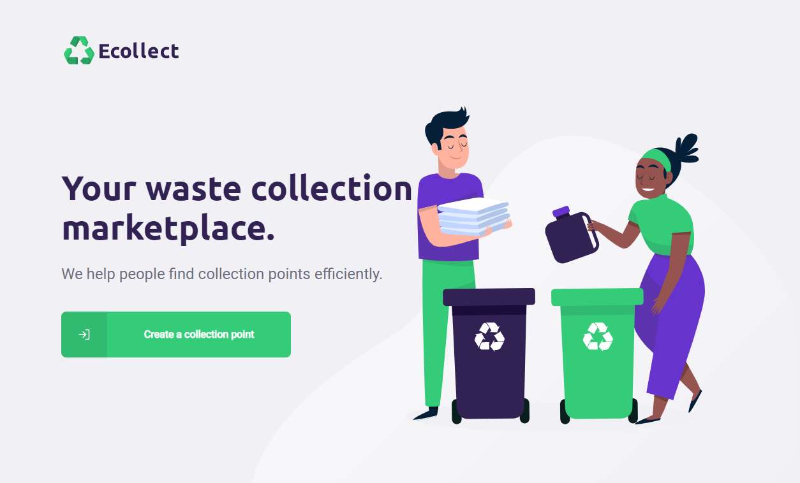
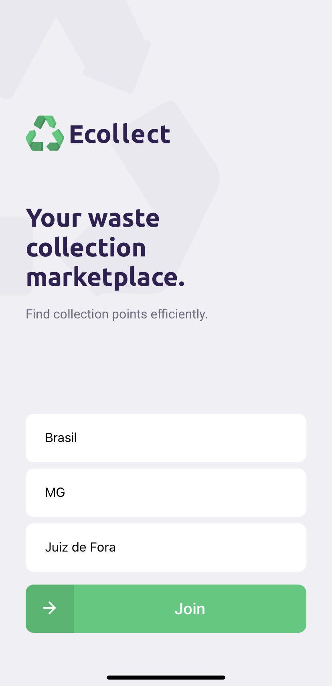
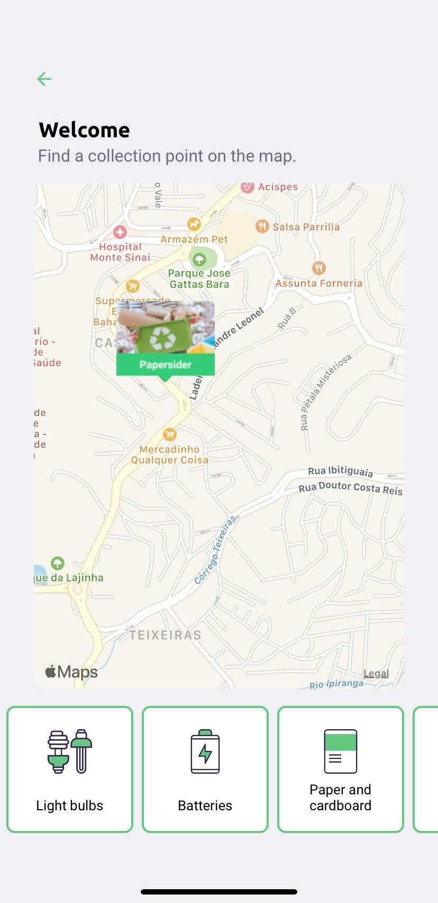

<h1 align="center">
    
</h1>

[Versão em português](#portuguese-version)

## 💻 About the project

Ecollect - is a way to connect companies and entities that collect organic and inorganic waste to people who need to dispose of their waste in an environmentally friendly way.

Companies or entities can register on the web platform by sending:
- an image of the collection point
- entity name, email and whatsapp
- and the address so it can appear on the map
- in addition to selecting one or more collection items:
   - lamps
   - Batteries
   - papers and cardboard
   - electronic waste
   - organic waste
   - kitchen oil

Users will have access to the mobile app, where they will be able to:
- browse the map to see registered companies
- contact the entity via E-mail or WhatsApp

### 🎨 Mobile

<p align="center">
  

  
</p>

### 🎨 Web

<p align="center" style="display: flex; align-items: flex-start; justify-content: center;">
  
</p>

 
## 🛠 Technologies

The following tools were used in the construction of the project:

- [Expo][expo]
- [Node.js][nodejs]
- [React][reactjs]
- [React Native][rn]
- [TypeScript][typescript]


## 🚀 How to run the project

We can consider this project as being divided into three parts:
1. Back End (server folder)
2. Front End (web folder)
3. Mobile (mobile folder)

💡Both Front End and Mobile need the Back End to be running to function.

### Prerequisites

Before starting, you will need to have the following tools installed on your machine:
[Git](https://git-scm.com), [Node.js][nodejs].
Also it's nice to have an editor to work with the code like [VSCode][vscode]

### 🎲 Running Back End

```bash
# Clone this repo
$ git clone https://github.com/sacul/ecollect

# Change current folder to project folder
$ cd Ecollect

# Go to server folder
$ cd server

# Install dependencies
$ npm install

# Run on dev mode
$ npm run dev:server

# Server should start on port 3333. Go to http://localhost:3333 
```

### 🧭 Runnning web app (Front End)

```bash
# Clone this repo
$ git clone https://github.com/sacul/ecollect

# Change current folder to project folder
$ cd Ecollect

# Go to web folder
$ cd web

# Install dependencies
$ npm install

# Run on dev mode
$ npm run start

# App shouçd run on port 3000. Go to http://localhost:3000
```

### 📱Running mobile app

```bash
# Clone this repo
$ git clone https://github.com/sacul/ecollect

# Change current folder to project folder
$ cd Ecollect

# Go to mobile folder
$ cd mobile

# Install dependencies
$ npm install

# Run app using Expo and follow Expo instructions
$ npm start
```

## 😯 How to contribute to the project

1. **Fork** the project.
2. Create a new branch with your changes: `git checkout -b my-feature`
3. Save the changes and create a commit message describing what you've done: `git commit -m "feature: My new feature"`
4. Push your changes: `git push origin my-feature`
> If you have any questions, check out this [GitHub Contribution Guide](https://github.com/firstcontributions/first-contributions)


Project developed during **NLW - Next Level Week** offered by [Rocketseat](rs).


# Portuguese Version

## 💻 Sobre o projeto

♻️ Ecollect - é uma forma de conectar empresas e entidades de coleta de resíduos orgânicos e inorgânicos as pessoas que precisam descartar seus resíduos de maneira ecológica.

As empresas ou entidades poderão se cadastrar na plataforma web enviando:
- uma imagem do ponto de coleta
- nome da entidade, email e whatsapp
- e o endereço para que ele possa aparecer no mapa
- além de selecionar um ou mais ítens de coleta: 
  - lâmpadas
  - pilhas e baterias
  - papéis e papelão
  - resíduos eletrônicos
  - resíduos orgânicos
  - óleo de cozinha

Os usuários terão acesso ao aplicativo móvel, onde poderão:
- navegar pelo mapa para ver as instituições cadastradas
- entrar em contato com a entidade através do E-mail ou do WhatsApp

### 🎨 Mobile

<p align="center">
  

  
</p>

### 🎨 Web

<p align="center" style="display: flex; align-items: flex-start; justify-content: center;">
  
</p>

 
## 🛠 Tecnologias

As seguintes ferramentas foram usadas na construção do projeto:

- [Expo][expo]
- [Node.js][nodejs]
- [React][reactjs]
- [React Native][rn]
- [TypeScript][typescript]


## 🚀 Como executar o projeto

Podemos considerar este projeto como sendo divido em três partes:
1. Back End (pasta server) 
2. Front End (pasta web)
3. Mobile (pasta mobile)

💡Tanto o Front End quanto o Mobile precisam que o Back End esteja sendo executado para funcionar.

### Pré-requisitos

Antes de começar, você vai precisar ter instalado em sua máquina as seguintes ferramentas:
[Git](https://git-scm.com), [Node.js][nodejs]. 
Além disto é bom ter um editor para trabalhar com o código como [VSCode][vscode]

### 🎲 Rodando o Back End (servidor)

```bash
# Clone este repositório
$ git clone https://github.com/sacul/ecollect

# Acesse a pasta do projeto no terminal/cmd
$ cd Ecollect

# Vá para a pasta server
$ cd server

# Instale as dependências
$ npm install

# Execute a aplicação em modo de desenvolvimento
$ npm run dev:server

# O servidor inciará na porta:3333 - acesse http://localhost:3333 
```

### 🧭 Rodando a aplicação web (Front End)

```bash
# Clone este repositório
$ git clone https://github.com/sacul/ecollect

# Acesse a pasta do projeto no seu terminal/cmd
$ cd Ecollect

# Vá para a pasta da aplicação Front End
$ cd web

# Instale as dependências
$ npm install

# Execute a aplicação em modo de desenvolvimento
$ npm run start

# A aplicação será aberta na porta:3000 - acesse http://localhost:3000
```

### 📱Rodando a aplicação mobile 

```bash
# Clone este repositório
$ git clone https://github.com/sacul/ecollect

# Acesse a pasta do projeto no terminal/cmd
$ cd Ecollect

# Vá para a pasta mobile
$ cd mobile

# Instale as dependências
$ npm install

# Execute a aplicação usando o Expo e siga as instruções
$ npm start
```

## 😯 Como contribuir para o projeto

1. Faça um **fork** do projeto.
2. Crie uma nova branch com as suas alterações: `git checkout -b my-feature`
3. Salve as alterações e crie uma mensagem de commit contando o que você fez: `git commit -m "feature: My new feature"`
4. Envie as suas alterações: `git push origin my-feature`
> Caso tenha alguma dúvida confira este [guia de como contribuir no GitHub](https://github.com/firstcontributions/first-contributions)


Projeto desenvolvido durante a **NLW - Next Level Week** oferecida pela [Rocketseat](rs).


[nodejs]: https://nodejs.org/
[typescript]: https://www.typescriptlang.org/
[expo]: https://expo.io/
[reactjs]: https://reactjs.org
[rn]: https://facebook.github.io/react-native/
[yarn]: https://yarnpkg.com/
[vscode]: https://code.visualstudio.com/
[vceditconfig]: https://marketplace.visualstudio.com/items?itemName=EditorConfig.EditorConfig
[license]: https://opensource.org/licenses/MIT
[vceslint]: https://marketplace.visualstudio.com/items?itemName=dbaeumer.vscode-eslint
[prettier]: https://marketplace.visualstudio.com/items?itemName=esbenp.prettier-vscode
[rs]: https://rocketseat.com.br
